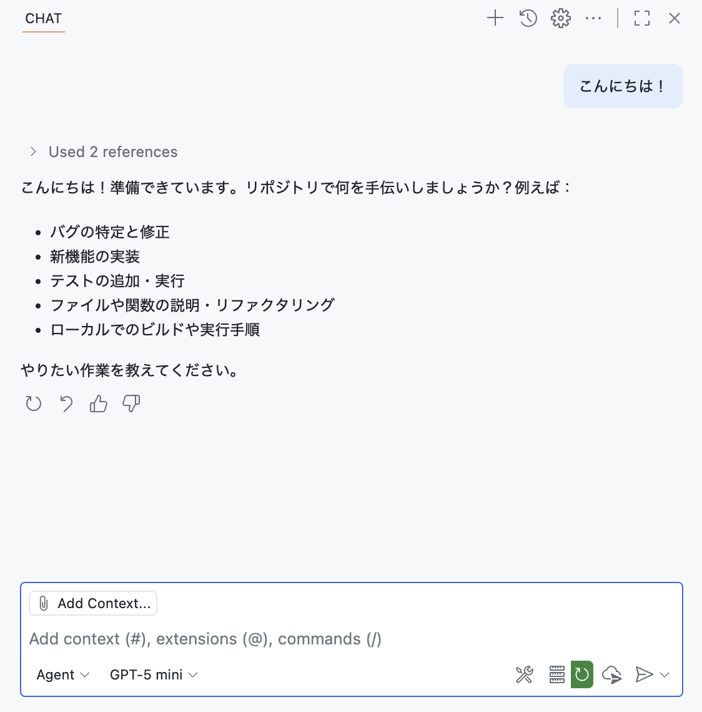
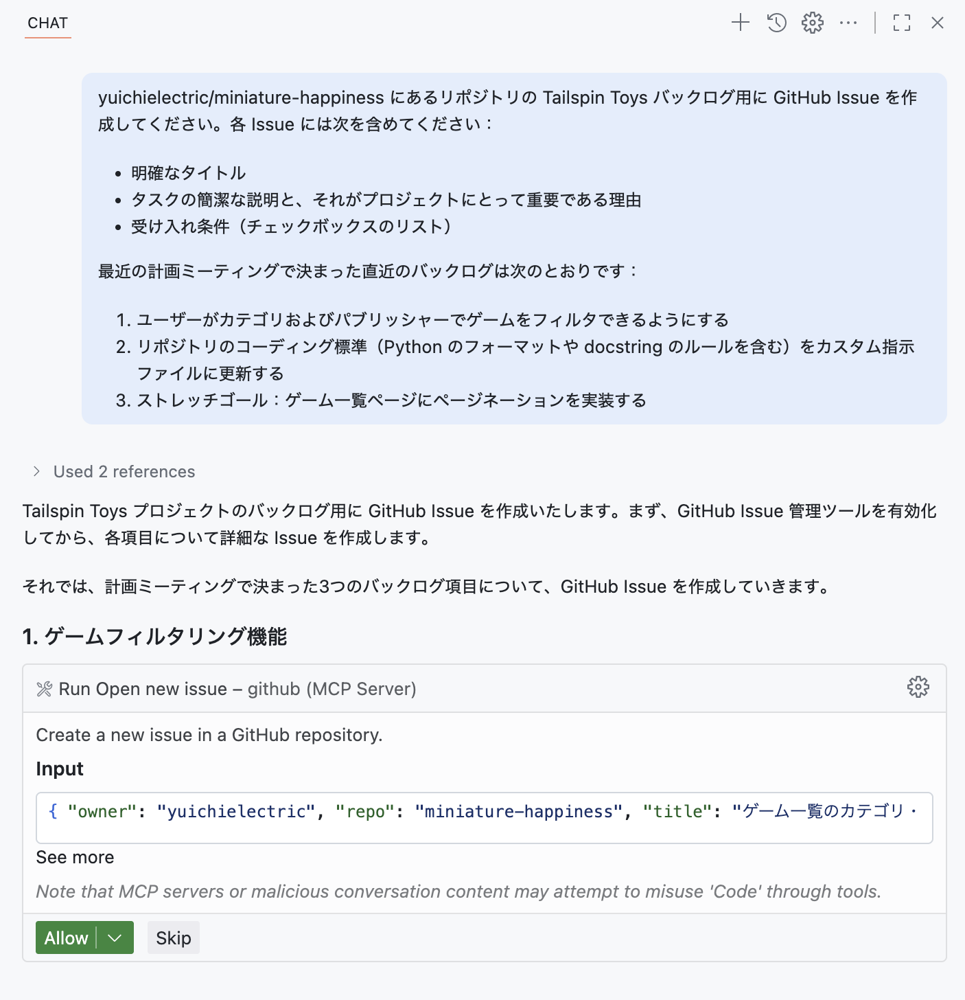
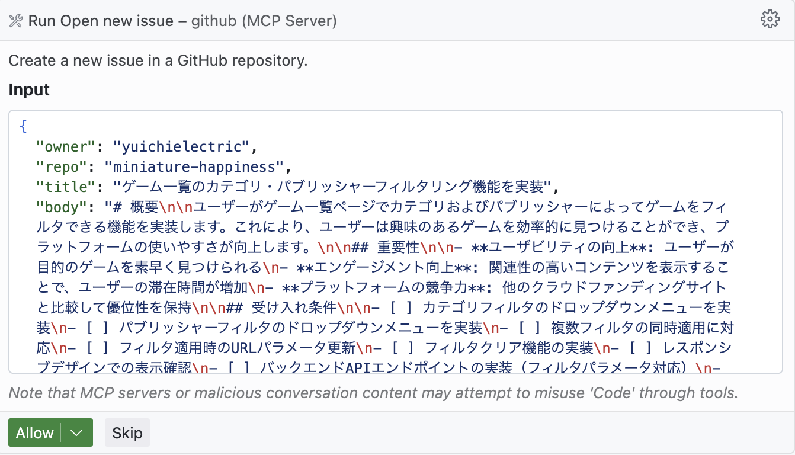
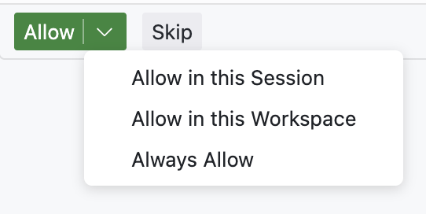
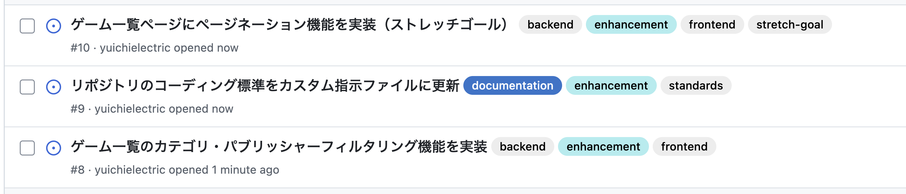

# 演習 2 - Copilot のエージェントモードと GitHub の MCP サーバーでバックログを準備する


コードを書くことは「コードを書く」だけではありません。Issue を起票したり、外部サービスを呼び出したり、情報を収集したりする必要があります。通常、これは外部ツールとのやり取りを伴い、開発者のフローを断ち切ってしまうことがあります。Model Context Protocol（MCP）の力を使えば、これらの機能すべてに Copilot から直接アクセスできます！

## シナリオ

あなたは Tailspin Toys（開発者をテーマにしたボードゲーム向けクラウドファンディング・プラットフォーム）のパートタイム開発者です。Web サイトに新機能を導入するためのさまざまなタスクが割り当てられています。良いチームメンバーとして、作業を追跡するために Issue を起票したいと考えています。将来の自分のために、Copilot の助けを借りることにしました。GitHub Copilot Chat のエージェントモードと GitHub Model Context Protocol（MCP）サーバーを使って、残りのラボで使う作業のバックログを作成します。

これを達成するために、次を行います：

- 外部ツールや機能にアクセスできる Model Context Protocol（MCP）を使用する。
- リポジトリに GitHub MCP サーバーを設定する。
- GitHub Copilot Chat のエージェントモードを使用して、リポジトリに Issue を作成する。

この演習が終わるころには、ラボの残りのステップで使用する GitHub Issue のバックログが作成できているはずです。

## エージェントモードと Model Context Protocol（MCP）とは？

GitHub Copilot Chat のエージェントモードは、Copilot をあなたの代わりにアクションを実行できる AI エージェントへと変身させます。このモードでは、より動的に Copilot とやり取りでき、テストやターミナルコマンドの実行、エディタから問題点の読み取り、その洞察を使ったコード更新など、ツールを使用してタスクを実行できます。これにより、より双方向で共同的なワークフローが可能になり、開発プロセスで AI の能力を活用できるようになります。

[Model Context Protocol（MCP）][mcp-blog-post] は、AI エージェントが外部ツールやサービスと通信する方法を提供します。MCP を使用することで、AI エージェントは外部ツールやサービスとリアルタイムに通信できます。これにより、（リソースを使用して）最新の情報にアクセスし、（ツールを使用して）あなたの代わりにアクションを実行できるようになります。

これらのツールやリソースは MCP サーバーを介してアクセスされます。MCP サーバーは AI エージェントと外部ツール・サービスの橋渡し役です。MCP サーバーは、AI エージェントと外部ツール（既存の API や NPM パッケージのようなローカルツールなど）との通信を管理します。各 MCP サーバーは、AI エージェントがアクセスできるツールとリソースの異なるセットを表します。


よく使われている既存の MCP サーバーの例：

- **[GitHub MCP サーバー][github-mcp-server]**：GitHub リポジトリを管理するための API 群にアクセスを提供します。新しいリポジトリの作成、既存リポジトリの更新、Issue や Pull Request の管理などを AI エージェントが実行できます。
- **[Playwright MCP Server][playwright-mcp-server]**：Playwright を用いたブラウザ自動化機能を提供します。Web ページのナビゲーション、フォーム入力、ボタンクリックなどの操作を AI エージェントが実行できます。
- **追加の参照サーバー**：他にも多数の MCP サーバーがあり、さまざまなツールやリソースにアクセスできます。Anthropic は参照実装・サードパーティ・コミュニティ実装を含む [MCP サーバーの一覧][anthropic-mcp-servers] を公開しています。 

> [!IMPORTANT]
> セキュリティの観点では、MCP サーバーをプロジェクト内の他の依存関係と同様に扱ってください。使用前にソースコードを慎重に確認し、発行者を検証し、セキュリティへの影響を検討しましょう。信頼できる MCP サーバーのみを使用し、機密リソースや操作へのアクセス付与には注意してください。

## Codespace の準備ができていることを確認する

[前の演習][prereqs-lesson] で、このラボの残りのコーディング演習で使用する Codespace を起動しました。ここでは本格的に使い始める前の最終調整を行います。

セットアップ手順では多数の [VS Code 拡張機能][vscode-extensions] がインストール・設定されました。あらゆるソフトウェアと同様に、更新が必要な場合があります。Codespace 作成後は、すべてが最新であることを確認しましょう。

1. Codespace を開始したタブに戻ります。タブを閉じてしまった場合は、リポジトリに戻り、**Code** > **Codespaces** を選択して、対象の Codespace 名を選びます。
2. Codespace 左側のワークベンチで **Extensions** を選択します。

    

3. **Update** ボタンが表示されている拡張機能は **Update** を選択します。必要に応じて繰り返します。
4. **Reload Window** ボタンが表示されている拡張機能は **Reload Window** を選択して Codespace を再読み込みします。
5. ダイアログが表示されたら **Reload** を選択してウィンドウを再読み込みします。これにより最新バージョンが使用されます。

## GitHub Copilot Chat とエージェントモードの使用

GitHub Copilot Chat のエージェントモードにアクセスするには、IDE に GitHub Copilot Chat 拡張機能がインストールされている必要があります。GitHub Codespace を使用している場合は、すでにインストール済みのはずです。

> [!TIP]
> もし GitHub Copilot Chat 拡張機能がインストールされていない場合は、[Visual Studio Code Marketplace からインストール][copilot-chat-extension] できます。あるいは VS Code の拡張機能ビューを開き、**GitHub Copilot Chat** を検索して **Install** を選択してください。

拡張機能をインストールしたら、有効化のために GitHub アカウントで認証が必要な場合があります。

1. Codespace に戻ります。
2. Codespace の上部にある **Copilot Chat** アイコンを選択します。
3. Copilot Chat ウィンドウで「こんにちは！」のようなメッセージを入力し、Enter を押します。これで Copilot Chat が起動するはずです。

    

4. 認証されていない場合は、GitHub アカウントへのサインインを促すプロンプトが表示されます。指示に従って認証してください。

    

5. 認証後、Copilot Chat ウィンドウが表示されます。

    

6. まだエージェントモードになっていない場合は、Copilot Chat ウィンドウのドロップダウンから **Agent** を選択して切り替えます。

    

7. モデルを **Claude Sonnet 4** に設定します。

    

> [!IMPORTANT]
> このラボの著者は特定のモデルを推奨する意図はありません。ラボの作成時には Claude Sonnet 4 を使用したため、手順にその記載があります。ねらいは、提案されるコードが比較的一貫して良い体験になるようにすることです。ただし LLM は確率的に動作するため、実際の提案が手順の記載と異なる場合があります。これは完全に正常で想定内です。

8. チャットペインが更新され、エージェントモードになったことが示されます。ツールアイコンが表示され、GitHub Copilot 用にツールを構成できることが確認できます。

    

通常、新しいプロジェクトを設定した直後は、まだ MCP サーバーを構成していないため、使用可能なツール数は 0 になります。しかし、スムーズに始められるよう、[GitHub MCP サーバー][github-mcp-server] 用のサンプル設定を含む **.vscode/mcp.json** ファイルを用意しています。次はそれを確認しましょう。

## GitHub MCP サーバーの設定

**.vscode/mcp.json** は、この Visual Studio Code ワークスペースで利用できる MCP サーバーを構成するためのファイルです。MCP サーバーは、GitHub Copilot があなたの代わりにアクションを実行するために使用できる外部ツールやリソースへのアクセスを提供します。

1. リポジトリ内の **.vscode/mcp.json** を開きます。
2. 次のような JSON 構造が表示されるはずです。

    ```json
    {
        "servers": {
            "github": {
                "type": "http",
                "url": "https://api.githubcopilot.com/mcp/"
            }
        }
    }
    ```

この構成により、GitHub Copilot は GitHub のリポジトリ、Issue、Pull Request などと対話するための追加ツール群にアクセスできます。この構成は [リモートの GitHub MCP サーバー][remote-github-mcp-server] を使用しています。この方法を用いると、ローカルで MCP サーバーを実行する（および最新版維持などの管理を行う）必要がなくなり、個人用アクセストークン（PAT）ではなく OAuth 2.0 を使用してリモートサーバーに認証できます。

MCP サーバーの構成は **mcp.json** の **servers** セクションで定義します。各 MCP サーバーは一意の名前（この例では github）と、そのタイプ（この例では **http**）で定義されます。ローカル MCP サーバーを使用する場合、タイプは **stdio** となり、MCP サーバーの起動方法を指定する **command** と **args** フィールドを持つことがあります。構成形式の詳細は [VS Code のドキュメント][vscode-mcp-config] を参照してください。一部の構成（OAuth を使うリモート GitHub MCP サーバーでは不要）では **inputs** セクションが見られることがあります。これは MCP サーバーが必要とする入力（機密トークンなど）を定義するものです。構成プロパティについては [VS Code のドキュメント][vscode-mcp-config] で詳しく読むことができます。

MCP サーバーを利用するには「起動」する必要があります。これにより、GitHub Copilot はサーバーと通信し、あなたが要求したタスクを実行できるようになります。

1. VS Code で **.vscode/mcp.json** を開きます。
2. GitHub MCP サーバーを起動するには、GitHub サーバーの上に表示される **Start** を選択します。

    

3. GitHub への認証を求めるポップアップが表示されるはずです。

    

4. このラボで使用するユーザーアカウントの **Continue** を選択します。

    

5. ページが表示されたら、**Authorize visual-studio-code** を選択して、選択したユーザーアカウントとして GitHub MCP サーバーのログインを許可します。完了すると、ページに「You can now close the window.」と表示されます。

    

6. GitHub Codespace に戻ると、GitHub MCP サーバーが起動したことが確認できるはずです。次の 2 か所で確認できます：
    - **.vscode/mcp.json** 内の、以前は Start と表示されていた行。複数のオプションが表示され、利用可能なツール数が示されているはずです。 
    - Copilot Chat ペインのツールアイコンを選択して、利用できるツールを表示します。画面上部に表示されるリストをスクロールすると、GitHub MCP サーバー由来のツール一覧が見えるはずです。

    

以上です！これで Copilot Chat のエージェントモードを使用して、Issue 作成や Pull Request の管理などが行えます。

> [!IMPORTANT]
> この MCP サーバー構成で問題が発生する場合は、[GitHub MCP サーバー][github-mcp-server] リポジトリに、ローカルまたはリモート MCP を用いる別の構成オプションが用意されています。GitHub の個人用アクセストークン（PAT）による認証が必要な構成を選ぶ場合は、トークンを誰とも共有しないようにしてください。パスワードと同様に厳重に管理する必要があります。つまり、ソース管理へコミットしたり、他者と共有したりしてはいけません。
>
> これは機密性の高いパスワードであるため、**mcp.json に直接貼り付けないでください**。代わりに **inputs** プロパティを使用して、トークンを入力変数として渡します。公開されたトークンはセキュリティ侵害の主因の 1 つです。

## タスクのバックログを作成する

GitHub MCP サーバーの設定ができたので、エージェントモードを使って、このラボで使用するタスクのバックログを作成しましょう。

1. Copilot Chat ペインに戻ります。ドロップダウンから **Agent** を選択します。モデルは **Claude Sonnet 4** に設定します。

    

2. 次のプロンプトを入力または貼り付け、**<YOUR_REPOSITORY_PATH>** をあなたのリポジトリの organization/name 形式のパスに置き換えます：

    ```markdown
    <YOUR_REPOSITORY_PATH> にあるリポジトリの Tailspin Toys バックログ用に GitHub Issue を作成してください。各 Issue には次を含めてください：
    - 明確なタイトル
    - タスクの簡潔な説明と、それがプロジェクトにとって重要である理由
    - 受け入れ条件（チェックボックスのリスト）

    最近の計画ミーティングで決まった直近のバックログは次のとおりです：

    1. ユーザーがカテゴリおよびパブリッシャーでゲームをフィルタできるようにする
    2. リポジトリのコーディング標準（Python のフォーマットや docstring のルールを含む）をカスタム指示ファイルに更新する
    3. ストレッチゴール：ゲーム一覧ページにページネーションを実装する
    ```

3. <kbd>enter</kbd> を押すか **Send** ボタンを選択して、プロンプトを Copilot に送信します。
4. GitHub Copilot はリクエストを処理し、Issue 作成を実行する前に確認を求めるダイアログボックスを表示するはずです。 

    

> [!IMPORTANT]
> AI は誤りを犯す可能性があるため、確定前に内容を必ず見直してください。

5. **Run open new issue** ボックスの **See more** を選択して、作成予定の Issue の詳細を表示します。
6. **owner**、**repo**、**title**、**body** の内容が正しいか確認します。必要であれば、本文をダブルクリックして内容を編集できます。
7. 生成内容を確認したら、**Allow** を選択して Issue を作成します。

    

8. 残りの Issue についても手順 4〜6 を繰り返します。あるいは、Copilot に自動作成を任せても問題ない場合は、**Allow** の横の下向き矢印を選択し、**Allow in this session** を選択して、このセッション（現在のチャット）に限り Copilot に Issue 作成を自動許可することもできます。

    

> [!IMPORTANT]
> **Allow in this session** や同等のオプションを選択する前に、Copilot があなたの代わりにタスクを自動実行することに十分に納得しているか確認してください。

9. 別のブラウザタブで GitHub のリポジトリを開き、Issues タブを選択します。
10. Copilot によって作成された Issue の一覧が表示されるはずです。各 Issue には、明確なタイトルと受け入れ条件のチェックボックスリストが含まれているはずです。

Issue はかなり詳細になっていることに気づくでしょう。これは、大規模言語モデル（LLM）と Model Context Protocol（MCP）の力により、明確な初期の Issue 説明が自動で作成できるためです。



## まとめと次のステップ

おめでとうございます。Copilot Chat と MCP を使って GitHub に Issue を作成できました！

この演習の要点：

- 外部ツールや機能にアクセスできる Model Context Protocol（MCP）を使用した。
- リポジトリに GitHub MCP サーバーを設定した。
- GitHub Copilot Chat のエージェントモードを使って、リポジトリに Issue を作成した。

GitHub MCP サーバーが構成できたので、今後は新しいリポジトリの作成、Pull Request の管理、リポジトリ横断の情報検索など、GitHub Copilot Chat のエージェントモードでさらに多くのアクションを実行できます。

次の演習では、組織で定義されたパターンやプラクティスに沿ってコードが生成されるようにするため、[カスタム指示によって Copilot にガイダンスを与える方法][next-lesson] を学びます。

### オプションの探究演習 – Microsoft Playwright MCP サーバーを設定する

さらに踏み込みたい場合は、[Microsoft Playwright MCP サーバー][playwright-mcp-server] など別の MCP サーバーをインストール・構成してみてください。これにより、GitHub Copilot Chat のエージェントモードで、Web ページのナビゲーション、フォーム入力、ボタンクリックなどのブラウザ自動化タスクを実行できるようになります。

Playwright MCP サーバーのインストールと構成手順は、[Playwright MCP リポジトリ][playwright-mcp-server] に記載されています。

セットアップ手順は GitHub MCP サーバーと似ていますが、GitHub の個人用アクセストークンのような認証情報を提供する必要はありません。これは、Playwright MCP サーバーがその機能にアクセスするための認証を必要としないためです。

## リソース

- [What the heck is MCP and why is everyone talking about it?][mcp-blog-post]
- [GitHub MCP サーバー][github-mcp-server]
- [Microsoft Playwright MCP Server][playwright-mcp-server]
- [Anthropic MCP Servers][anthropic-mcp-servers]
- [VS Code 拡張機能][vscode-extensions]
- [GitHub Copilot Chat 拡張機能][copilot-chat-extension]
- [細分化された個人用アクセストークンの作成][github-pat-docs]

---

 次の演習に進むには以下のリンクをクリックしてください。
 [次の演習：インストラクションファイルで Copilot にコンテキストを提供する](./3-custom-instructions.md)

[previous-lesson]: ./1-copilot-coding-agent.md
[next-lesson]: ./3-custom-instructions.md
[prereqs-lesson]: ./0-prereqs.md
[mcp-blog-post]: https://github.blog/ai-and-ml/llms/what-the-heck-is-mcp-and-why-is-everyone-talking-about-it/
[github-mcp-server]: https://github.com/github/github-mcp-server
[playwright-mcp-server]: https://github.com/microsoft/playwright-mcp
[anthropic-mcp-servers]: https://github.com/modelcontextprotocol/servers
[vscode-extensions]: https://code.visualstudio.com/docs/configure/extensions/extension-marketplace
[copilot-chat-extension]: https://marketplace.visualstudio.com/items?itemName=GitHub.copilot
[github-pat-docs]: https://docs.github.com/ja/authentication/keeping-your-account-and-data-secure/managing-your-personal-access-tokens#creating-a-fine-grained-personal-access-token
[remote-github-mcp-server]: https://github.blog/changelog/2025-06-12-remote-github-mcp-server-is-now-available-in-public-preview/
[vscode-mcp-config]: https://code.visualstudio.com/docs/copilot/chat/mcp-servers#_configuration-format
