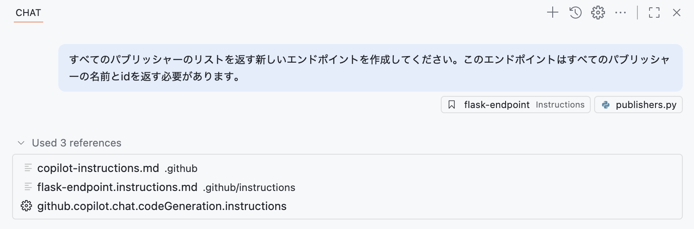

# 演習 3 - インストラクションファイルで Copilot にコンテキストを与える


人生の多くの側面でも生成 AI でも、コンテキストは鍵です。特定のやり方で完了すべきタスクや、重要な背景情報がある場合、Copilot がその情報にアクセスできるようにしたくなります。[インストラクションファイル][instruction-files] を使うことで、Copilot に「何をしてほしいか」だけでなく「どのようにやってほしいか」も伝えるガイダンスを提供できます。

この演習では次のことを学びます：

- **.github/copilot-instructions.md** というカスタムインストラクションを用いて、プロジェクト固有のコンテキスト、コーディングガイドライン、ドキュメント標準を Copilot に提供する。
- インストラクションファイルで、反復的またはテンプレート化されたタスクに対する Copilot の挙動を導く。
- リポジトリ全体のインストラクションと、タスク固有のインストラクションの両方を実装する。

## シナリオ

優れた開発組織である Tailspin Toys には、開発プラクティスに関するガイドラインと要件があります。例えば：

- API には常にユニットテストが必要。
- UI はダークモードでモダンな印象にする。
- ドキュメントは docstring やヘッダーコメントの形でコードに追加する。

インストラクションファイルを用いることで、ここで強調したプラクティスに沿ってタスクを実行できるよう、Copilot に正しい情報を確実に与えます。

## 始める前に

これからコードを変更するので、通常どおり作業用の新しいブランチを作成しましょう。これにより、準備が整うまで main ブランチへ影響を与えずに変更できます。

1. 前の演習で使った Codespace に戻ります。
2. Codespace 内で <kbd>Ctrl</kbd>+<kbd>\`</kbd> を押して新しいターミナルウィンドウを開きます。
3. 次のコマンドをターミナルで実行して、新しいブランチを作成・切り替えます：

   ```bash
   git checkout -b add-filters
   ```

## カスタムインストラクション

カスタムインストラクションを使うと、あなたのコーディングスタイルや要件を Copilot Chat に伝えられます。これは強力な機能で、より関連性の高い提案やコードスニペットを Copilot から引き出す助けになります。好みのコーディング規約、ライブラリ、コメントのスタイルなども指定できます。リポジトリ全体向けのインストラクションも作れますし、タスクレベルのコンテキストとして特定種類のファイル向けに作ることもできます。

インストラクションファイルには 2 種類あります：

* **.github/copilot-instructions.md**：**すべて**のチャットプロンプトに対して Copilot に送られる単一のインストラクションファイル。プロジェクトレベルの情報や、すべてのメッセージに関連するコンテキストを含めます。使用する技術スタック、作っているものの概要、Copilot への全体的な指針などが該当します。
* **\*.instructions.md**：特定のタスクやファイル種別向けに作成できます。例えば（Python や TypeScript など）特定言語向けのガイドや、React コンポーネントの作成、リポジトリパターンの新規実装といったタスク向けのガイドラインに使えます。

> [!NOTE]
> IDE で作業する際、インストラクションファイルは Copilot Chat による**コード生成**にのみ使われ、コード補完には使われません。

## カスタムインストラクションを更新する前に Copilot Chat を使ってみる

カスタムインストラクションの効果を見るため、まず現状のファイルでプロンプトを送ってみます。その後、更新を行い、同じプロンプトを再送して違いを確認します。

1. Codespace に戻ります。
2. 意図したコンテキストだけを Copilot に渡すため、前の演習で開いていたファイルをすべて閉じます。
3. **server/routes/publishers.py**（空のファイル）を開きます。
4. Codespace 上部の Copilot アイコンから **Copilot Chat** を開きます。
5. **New Chat** ボタンを選び、新しいチャットセッションを作成します（これで以前のコンテキストが消えます）。

   

6. モードのドロップダウンから **Ask** を選択します。

   

7. すべてのパブリッシャーを返す新規エンドポイントを作成するため、次のプロンプトを送信します：

   ```plaintext
   すべてのパブリッシャーのリストを返す新しいエンドポイントを作成してください。このエンドポイントはすべてのパブリッシャーの名前とidを返す必要があります。
   ```

8. 生成されたコードには [型ヒント][python-type-hints] が含まれていることに気づくはずです。これは（後で見るように）カスタムインストラクションに型ヒントを含める指示があるためです。
9. 一方で、docstring やコメントヘッダーが **欠けている**（あるいは両方欠けている）ことにも注意してください。

> [!IMPORTANT]
> 先に強調したとおり、GitHub Copilot や LLM ツールは確率的であり決定論的ではありません。そのため、生成されるコードは毎回同じとは限りませんし、明示しなくてもこちらのルールを守る場合さえあります！とはいえ、コードの一貫性のため、Copilot に「コード生成の方針」を理解させたい事項は常にドキュメント化しておくべきです。

## copilot-instructions.md にグローバル標準を追加する

前述のとおり、**copilot-instructions.md** はプロジェクトレベルの情報を Copilot に与えるためのファイルです。Copilot Chat の提案品質を高めるため、グローバルなコーディング標準を文書化しましょう。

1. Codespace に戻ります。
2. **.github/copilot-instructions.md** を開きます。
3. プロジェクトの簡単な説明や **コーディング標準**、**スクリプト**、**GitHub Actions ワークフロー** のセクションがあることを確認します。これらは Copilot とのあらゆるやり取りに当てはまり、堅牢で、何をどう進めたいかの明確な指針になります。
4. 16 行目付近にある **フォーマット要件** セクションを探し、型ヒント使用の注意が含まれていることを確認します。先ほどのコードに型ヒントがあったのはこのためです。
5. 型ヒントに関する注意の直下に、Copilot にファイル先頭コメントと docstring の追加を指示する次の行を追記します：

   ```markdown
   - すべての関数はdocstring、またはその言語における同等のものを持つべきです。
   - インポートやコードの前に、ファイルの目的を説明するコメントブロックを追加してください。
   ```

6. **copilot-instructions.md** を閉じます。
7. Copilot Chat で **New Chat** を選択し、バッファをクリアして新しい会話を開始します。
8. フォーカスが正しく当たるよう **server/routes/publishers.py** に戻ります。
9. 先ほどと同じプロンプトを送信して、エンドポイントを作成します。

   ```plaintext
   すべてのパブリッシャーのリストを返す新しいエンドポイントを作成してください。このエンドポイントはすべてのパブリッシャーの名前とidを返す必要があります。
   ```

> [!TIP]
> キーボードの上下矢印で以前のプロンプトを巡回できます。

8. 今回生成されたコードでは、ファイル先頭に次のようなコメントヘッダーが含まれていることに注目してください：

   ```python
   """
   パブリッシャー APIは Tailspin Toys Crowd Funding platform のルートです。
   このモジュールはパブリッシャー情報を取得するためのエンドポイントを提供します。
   """
   ```

9. さらに、関数内に次のような docstring が含まれていることにも注目してください：

   ```python
   """
   すべてのパブリッシャーのリストを返すエンドポイント
 
   Returns:
      Response: パブリッシャーオブジェクトの配列を含むJSONレスポンス
   """
   ```

10. 既存コードは自動更新されていませんが、必要なら Copilot に更新を依頼できます。

11. **この時点では提案の適用はしません**。次のセクションで実施します。

このセクションでは、カスタムインストラクションファイルが、確立したガイドラインに従うコードを生成するためのコンテキストを Copilot に与えていることを確認しました。

## タスク向けインストラクションファイル

コーディングには反復作業がつきものです。Copilot はこうした作業の肩代わりに最適です。しかし、エンドポイントの追加、コンポーネント作成、新しいサービスパターンの実装など、多くの作業は特定のテンプレートや構造に従う必要があります。インストラクションファイルを使うと、こうしたタスク向けの具体的な要件を提示できます。手動で Copilot Chat に追加することも、ファイル先頭に **applyTo:** タグを付けて特定ファイルに自動適用させることもできます。

今回は、既存の [games エンドポイント][games-endpoints] と同じパターンでパブリッシャー一覧の新規エンドポイントを作成し、テストも既存の [games エンドポイントのテスト][games-tests] と同じパターンに従って作成します。すでにインストラクションファイルが用意されているので、これを確認し、生成コードの違いを見てみましょう。

1. **.github/instructions/python-tests.instructions.md** を開きます。

2. 先頭の **applyTo:** セクションに注目します。これは **server/tests** ディレクトリ配下で **test\_** で始まり **.py** 拡張子を持つファイルすべてを対象とするフィルターです。Copilot Chat がこのパターンに一致するファイルとやり取りする際、このファイルのガイダンスが自動的に使用されます。

3. このファイルには、テストの作り方や、データベース機能のテスト時に SQLite を利用する方法のガイダンスが含まれていることを確認します。

4. **.github/instructions/flask-endpoint.instructions.md** を開きます。

5. 次の内容を確認します：

   * 必要要件の概要（テスト必須、Flask の blueprint を用いてエンドポイントを作成する、など）。
   * 先ほどの **python-tests.instructions.md** へのリンク。
   * 目標とするパターンに従った既存の 2 つのファイル（games の blueprint とテスト）へのリンク。通常の Markdown リンクとして設定されており、インストラクションファイルが追加のファイルをコンテキストに取り込めるようになっています。

6. フォーカスが正しく当たるよう **server/routes/publishers.py** に戻ります。
7. Copilot Chat に戻り、**New Chat** を選択して新しいセッションを開始します。
8. モードのドロップダウンから **Edit** を選択します。これで Copilot が複数ファイルを更新できるようになります。

   

> [!NOTE]
> このパートでテストの実行に問題が出た場合は、変更を元に戻し、上の手順から **Agent** モードでやり直してください。

9. **Add Context** ボタンを選択してコンテキストダイアログを開きます。
10. クリップボードのテキストや画像へのアクセス許可を求められたら **Allow** を選択します。
11. Codespace 上部のドロップダウンから **Instructions** を選択します。

> [!TIP]
> 候補が多い場合は **instructions** と入力して絞り込み、**Instructions** を選択できます。

12. **flask-endpoint .github/instructions** を選択して、インストラクションファイルをコンテキストに追加します。

   

13. 先ほどと同じプロンプトを送って、目的のエンドポイントを生成します：

   ```plaintext
   すべてのパブリッシャーのリストを返す新しいエンドポイントを作成してください。このエンドポイントはすべてのパブリッシャーの名前とidを返す必要があります。
   ```

14. **References** セクションに注目し、**flask-endpoint.instructions.md** がコンテキストとして使われていることを確認します。エージェントモードでインストラクションファイルを使うと、Copilot はその中で参照されるファイルを探索・読込します。

   

15. Copilot がファイルを生成します。**publishers.py** や **test\_publishers.py** など、複数ファイルにわたり更新が生成される点に注目してください。

> [!NOTE]
> 生成コードが、設定した標準から一部逸れることがあります。Copilot のような AI ツールは非決定的で、常に同じ結果にはなりません。コードベースの他のファイルに docstring やコメントヘッダーがないと、Copilot が別の方向に誘導される可能性もあります。一貫性が重要です。確立されたパターンにコードが従っているか確認しましょう。チャットで追記指示を出し、コーディング標準に従うよう求めれば、より正しい方向に導けます。

16. コードを確認したら、Copilot Chat で **Keep** を選択して変更を受け入れます。
17. <kbd>Ctrl</kbd>+<kbd>\`</kbd> でターミナルを開きます。
18. 次のコマンドでスクリプトを実行し、テストを実行します：

   ```sh
   ./scripts/run-server-tests.sh
   ```

19. **Permission denied** というエラーメッセージが表示される場合があります。これは Copilot に助けてもらいましょう。Copilot Chat で新しいチャットを開始し、**Agent** モードに切り替え、次のプロンプトを入力して Enter を押します。

   ```plaintext
   run-server-tests.sh コマンドを実行してください。
   ```

Copilot は 1～2 個の提案を返し、その中の正解には不足している実行権限を修正する chmod コマンドが含まれているはずです！

20. コードが正しく、すべてのテストがパスしたら、Codespace 左側の **Source Control** パネルを開き、Copilot による変更を確認します。
21. **Source Control** パネルで **+** アイコンを選択して変更をステージします。
22. **Sparkle** ボタンでコミットメッセージを自動生成します。

    

23. **Commit** を選択してリポジトリにコミットします。

## まとめと次のステップ

おめでとうございます！組織で定めたプラクティスに従うコードを生成できるよう、Copilot に適切なコンテキストを与える方法を体験しました。これは、**.github/copilot-instructions.md** によるリポジトリレベルでも、インストラクションファイルによるタスク単位でも実現できます。ここで学んだのは次のとおりです：

* カスタムインストラクション（.github/copilot-instructions.md）で、プロジェクト固有のコンテキスト、コーディングガイドライン、ドキュメント標準を Copilot に提供する。
* インストラクションファイルで、反復作業やテンプレート化タスクのガイダンスを行う。
* リポジトリ全体とタスク固有の両インストラクションを実装する。

次は [エージェントモードでサイトに機能を追加][next-lesson] します。

## リソース

* [GitHub Copilot のカスタマイズ向けインストラクションファイル][instruction-files]
* [カスタムインストラクション作成のベストプラクティス][instructions-best-practices]
* [GitHub Copilot の個人カスタムインストラクション][personal-instructions]

---

次の演習に進むには以下のリンクをクリックしてください。
[次の演習：Copilot のエージェントモードで新機能を追加する](./4-copilot-agent-mode-vscode.md)

[previous-lesson]: ./2-mcp.md
[next-lesson]: ./4-copilot-agent-mode-vscode.md
[instruction-files]: https://code.visualstudio.com/docs/copilot/copilot-customization
[python-type-hints]: https://docs.python.org/3/library/typing.html
[games-endpoints]: ../server/routes/games.py
[games-tests]: ../server/tests/test_games.py
[instructions-best-practices]: https://docs.github.com/ja/enterprise-cloud@latest/copilot/using-github-copilot/coding-agent/best-practices-for-using-copilot-to-work-on-tasks#adding-custom-instructions-to-your-repository
[personal-instructions]: https://docs.github.com/ja/copilot/customizing-copilot/adding-personal-custom-instructions-for-github-copilot
