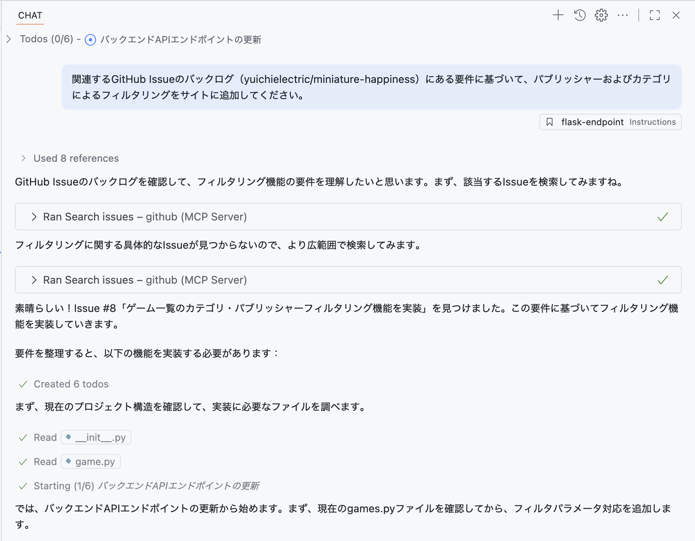
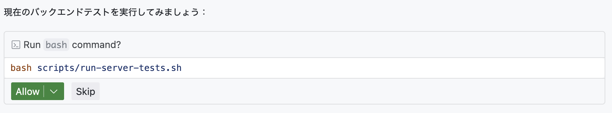

# 演習 4 - Copilot のエージェントモードで新機能を追加する


アプリに対する最も単純な更新でさえ、複数ファイルの変更やテスト実行などの操作が必要になるのが一般的です。開発者のフローは通常、必要なファイルを探し出し、変更し、テストを実行し、デバッグし、見落としていたファイルを特定して、さらに修正して……という繰り返しになります。

ここで役に立つのが Copilot のエージェントモードです。

Copilot のエージェントモードは、より自律的に動作するよう設計されています。まず既存のプロジェクト構造を探索し、必要な更新を行い、テストなどのタスクを実行し、見つかった不具合を自動で修正する、といった具合に開発者のように振る舞います。エージェントモードを使って、どのようにサイトへ新機能を導入できるか見ていきましょう。

この演習では、次のことを学びます：

- GitHub Copilot のエージェントモードが、バックエンドとフロントエンドの両コードベースにわたる新機能を実装できること。
- エージェントモードがプロジェクトを探索し、関連ファイルを特定して、連携した変更を行えること。
- マージ前に、エージェントモードが生成した変更とテストをレビューする方法。

## シナリオ

ゲームの数が増えるにつれ、ユーザーがカテゴリでフィルタできるようにしたくなりました。これは API と UI の両方の更新に加え、API のテスト更新も必要です。Copilot のエージェントモードの助けを借りて、AI のペアプロとともに新機能を追加しましょう！

## Tailspin Toys の Web サイトを実行する

変更を加える前に、現在の機能を理解するため Tailspin Toys の Web サイトを動かしてみましょう。

この Web サイトは、開発者をテーマにしたボードゲーム向けのクラウドファンディング・プラットフォームです。ユーザーはゲームを一覧表示し、その詳細を表示できます。サイトは 2 つの主要コンポーネントから構成されます：フロントエンド（Svelte で作成）とバックエンド（Python で作成）です。

### サイトの起動

サイトの起動を簡単にするため、フロントエンドとバックエンドの両サーバーを起動するスクリプトを用意しています。GitHub Codespace で次の手順に従ってスクリプトを実行し、サイトを起動します。

1. Codespace に戻ります。現在のブランチで作業を続けます。
2. Codespace 内で <kbd>Ctrl</kbd>+<kbd>\`</kbd> を押して新しいターミナルを開きます。
3. 次のスクリプトを実行してサイトを起動します（権限エラーが出たら Copilot に助けを求めてください）。

   ```bash
   scripts/start-app.sh
   ```

スクリプトが動き始めると、フロントエンドとバックエンドの両サーバーが起動したことを示す次のような出力が表示されます。

   ```bash
   Server (Flask) running at: http://localhost:5100
   Client (Astro) server running at: http://localhost:4321
   ```

> [!NOTE]
> [http://localhost:5100](http://localhost:5100) をブラウザで開くかどうか尋ねるダイアログが出たら、**x** を選んで閉じてください。

4. ターミナルに表示されたクライアントのアドレス（[http://localhost:4321](http://localhost:4321)）を <kbd>Ctrl</kbd>-**クリック**（Mac の場合は <kbd>Cmd</kbd>-**クリック**）してサイトを開きます。

> [!NOTE]
> Codespace では、ターミナルの localhost リンクを選択すると自動的に `https://<your-codespace-name>-4321.app.github.dev/` にリダイレクトされます。これは Web サーバーをホストしているあなたの Codespace へのプライベートトンネルです。

### サイトを探索する

サイトが起動したら、機能を確認してみましょう。主な機能は次のとおりです。

* **ホームページ**：ボードゲームのタイトル、画像、説明の一覧を表示します。
* **ゲーム詳細ページ**：ゲームを選択すると、タイトル、説明、パブリッシャー、カテゴリなど、より詳しい情報が表示されます。

## Copilot でバックログを確認する

初期実装は動作しますが、さらに機能を拡張したいと考えています。まずはバックログの確認から始めましょう。前の演習で作成したバックログ項目を Copilot に表示してもらいます。

1. Codespace に戻ります。
2. **Copilot Chat** を開きます。
3. **New Chat** ボタンを選んで新しいチャットセッションを作成し、以前のコンテキストを消去します。
4. モード一覧から **Agent** が選択されていることを確認します。

   

5. 利用可能なモデル一覧から **Claude Sonnet 4** を選択します。

> [!IMPORTANT]
> 本ラボの著者は特定モデルを推奨していません。ラボ作成時には Claude Sonnet 4 を使用したため手順に記載しています。提案内容を比較的一貫させ良い体験を提供するのがねらいです。ただし LLM は確率的に動作するため、提案が手順記載と異なることがあります。これは正常で想定内です。

5. 先ほど控えた **<YOUR_REPOSITORY_PATH>**（organization/name 形式）を使い、次のプロンプトでバックログの Issue を尋ねます。

   ```plaintext
   リポジトリ <YOUR_REPOSITORY_PATH> のバックログ項目を表示してください。ユーザーにとって最も有用なものを優先するように優先順位付けするのを手伝ってください。
   ```

6. GitHub Copilot が、適切な情報にアクセスするために **list_issues** を実行すべき MCP コマンドとして（おそらく）特定することに注目します。

> [!NOTE]
> LLM の確率的性質により、Copilot は別の MCP コマンドを使うことがありますが、同じタスクを完了できるはずです。

7. 求められたら、Issue 一覧を取得するコマンドを実行するため **Continue** を選びます。
8. 生成された Issue の一覧を確認します。

Copilot は、ユーザーにとって有用と思われる順に項目を優先順位づけしてくれる点にも注目してください。

## フィルタ機能を実装する

フィルタ機能を実装するには、少なくとも次の 3 つの更新が必要です。

* API に新しいエンドポイントを追加
* 新エンドポイント用のテストを追加
* 機能を導入するための UI 更新

さらに、コードベースにマージする前に、テストを実行して（合格させて）おく必要があります。Copilot のエージェントモードなら、これらのタスクを実行できます。機能を追加していきましょう。

1. 現在の Copilot との会話を続けてもよいですし、**New Chat** を選んで新たに始めても構いません。
2. **Add Context** を選び、**Instructions** から **flask-endpoint .github/instructions** をインストラクションファイルとして追加します。

   

> [!NOTE]
> エージェントモードがこのファイルを自動で見つける場合もありますが、**.instructions.md** のような重要情報を把握しているなら、必ず Copilot のコンテキストに追加しましょう。Copilot（とあなた）の成功確率が上がります。

3. **Agent** モードが選択されていることを再確認します。

   

4. モデルが **Claude Sonnet 4** のままであることを確認します。

5. 先ほど作成した Issue を元に機能実装を促すため、次のプロンプトを送ります。**<YOUR_REPOSITORY_PATH>** は organization/name 形式で置き換えてください。

   ```plaintext
   関連するGitHub Issueのバックログ（<YOUR_REPOSITORY_PATH>）にある要件に基づいて、パブリッシャーおよびカテゴリによるフィルタリングをサイトに追加してください。
   ```

6. Copilot が、目的の機能に関係するファイルを特定するためプロジェクト探索から始める様子を観察します。API と UI の定義、さらにテストが見つかるはずです。その後、ファイルの修正やテスト実行を開始します。

   

> [!NOTE]
> Copilot はプロジェクト探索、ファイル修正、テスト実行など、いくつものタスクを行います。タスクやコードベースの複雑さによっては数分かかることがあります。その間、エディタに **Keep** と **Undo** のボタンが出ることがありますが、Copilot の処理が完了すればすべての変更に対する **Keep**／**Undo** が提示されます。作業中に選ぶ必要はありません。

Copilot は上記の作業を完了するまでに **最大 5 分程度** かかる場合があります。Copilot ウィンドウで処理が終わり、Allow のプロンプトが表示されるまで待ちましょう。

7. Copilot の指示に従って、**Allow** を選択してテストを実行します。

   

8. 途中でテストが失敗することがありますが、問題ありません。Copilot はタスク完了まで、コード生成とテストの間を行き来してエラーがなくなるまで作業を続けます。

9. 生成されたコードに潜在的な問題がないか確認します。

> [!IMPORTANT]
> Copilot を含む AI ツールが生成したコードは、常にレビューすることが重要です。

10. サイトを実行中のブラウザに戻り、新機能を試します。
11. すべてが正しく動作し、コードのレビューも終えたら、Copilot Chat ウィンドウで **Keep** を選択します。

## ブランチを公開する

ローカルで変更ができたら、チームレビューと DevOps プロセスに進むための Pull Request（PR）を作成する準備が整いました。最初のステップはブランチの公開です。まずはこちらを行います。

1. Codespace の **Source Control** パネルで、Copilot による変更を確認します。
2. **+** アイコンを選んで変更をステージします。
3. **Sparkle** ボタンでコミットメッセージを生成します。

   

4. **Commit** をクリックします。
5. **Publish branch** を選んでブランチをリポジトリへプッシュします。

## Pull Request を作成する

Pull Request を作成する方法はいくつかあります（github.com や GitHub CLI など）。しかしすでに GitHub Copilot を使っているので、PR の作成も任せてしまいましょう。関連する Issue を見つけ、紐付けた PR を作成してくれます。

1. Copilot Chat パネルで **New Chat** を選び、新しいセッションを開始します。
2. 次のプロンプトで PR 作成を依頼します。**<YOUR_REPOSITORY_PATH>** は organization/name 形式で置き換えてください。

   ```plaintext
   <YOUR_REPOSITORY_PATH>でカテゴリとパブリッシャーによるフィルタリングに関連する問題を特定してください。現在の add-filters ブランチに対して新しい Pull Request を作成し、それを該当する issue に紐付けてください。
   ```

3. 必要に応じて **Continue** を選び、情報収集と操作実行を Copilot に許可します。
4. Copilot が Issue を検索し、該当のものを見つけ、PR を作成する様子を確認します。
5. Copilot が生成したリンクを選択して PR を確認します。ただし、**まだマージはしないでください**。

## まとめと次のステップ

おめでとうございます！この演習では、GitHub Copilot のエージェントモードを使って Tailspin Toys の Web サイトへ新機能を追加する方法を学びました。学んだ内容は次のとおりです。

* GitHub Copilot のエージェントモードが、バックエンドとフロントエンドにわたって新機能を実装できること。
* エージェントモードがプロジェクトを探索し、関連ファイルを特定して、連携した変更を行えること。
* マージ前に、エージェントモードが生成した変更とテストをレビューする方法。

次の演習では、エージェントに任せた Issue への取り組みがどれほどうまくいったかを確認します。

### おまけの探究演習 – ページングを実装する

ゲームの一覧が増えると、ページングが必要になります。本演習で学んだスキルを使って、ページング実装を Copilot に促してみましょう。考慮事項としては：

* 既存のベストプラクティスに従い、既存のプロンプトファイルを使う（または新規作成する）。
* ページングの実装方針（ページサイズをユーザーが選べるようにするか、固定にするか）を検討する。
* プロンプト作成時、望む実装になるよう Copilot に必要なガイダンスを与える。
* 変更依頼やコンテキスト提供を交えて Copilot と反復する必要があるかもしれません。これは Copilot と作業する際の通常のフローです！

## リソース

* [Coding agent 101][coding-agent-101]
* [Copilot の ask / edit / agent モード：できることと使いどき][choose-mode]
* [VS Code におけるエージェントモード][vs-code-agent-mode]

---

次の演習に進むには以下のリンクをクリックしてください。
[次の演習：GitHub Copilotコーディングエージェントの成果をレビューする](./5-reviewing-coding-agent.md)

[previous-lesson]: ./3-custom-instructions.md
[next-lesson]: ./5-reviewing-coding-agent.md
[coding-agent-101]: https://github.blog/ai-and-ml/github-copilot/agent-mode-101-all-about-github-copilots-powerful-mode/
[choose-mode]: https://github.blog/ai-and-ml/github-copilot/copilot-ask-edit-and-agent-modes-what-they-do-and-when-to-use-them/
[vs-code-agent-mode]: https://code.visualstudio.com/docs/copilot/chat/chat-agent-mode
