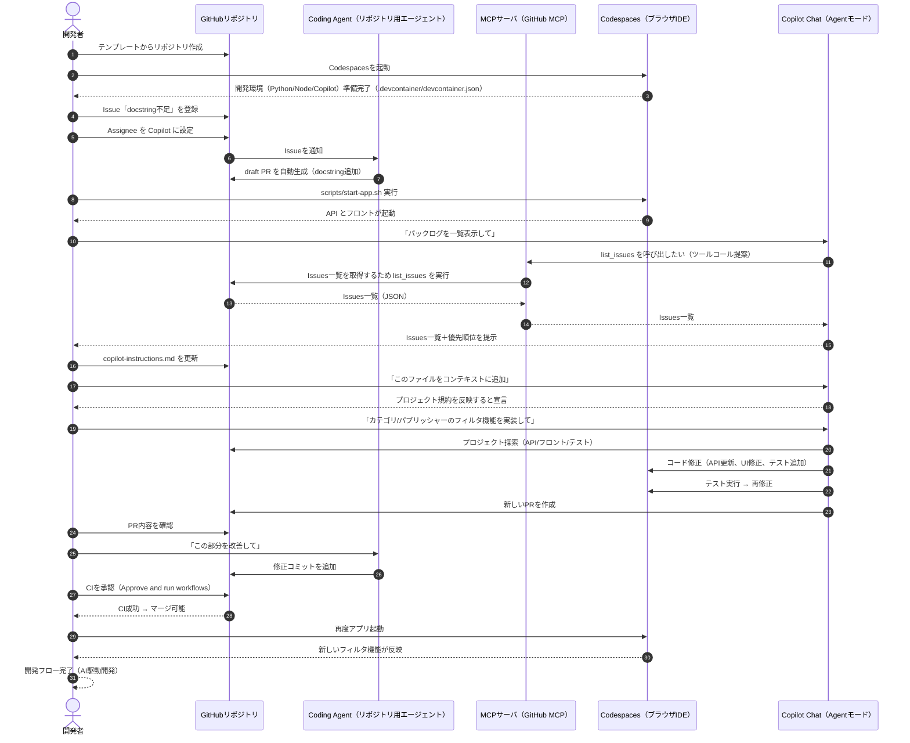

```mermaid

sequenceDiagram
    autonumber

    actor Dev as 開発者
    participant Repo as GitHubリポジトリ
    participant CodingAgent as Coding Agent（リポジトリ用エージェント）
    participant MCP as MCPサーバ（GitHub MCP）
    participant Codespaces as Codespaces（ブラウザIDE）
    participant ChatAgent as Copilot Chat（Agentモード）

    %% Scene 1:リポジトリ作成と Codespaces 起動
    Dev ->> Repo: テンプレートからリポジトリ作成
    Dev ->> Codespaces: Codespacesを起動
    Codespaces -->> Dev: 開発環境（Python/Node/Copilot）準備完了（.devcontainer/devcontainer.json）

    %% Scene 2：Issue → Coding Agent 自動実行
    Dev ->> Repo: Issue「docstring不足」を登録
    Dev ->> Repo: Assignee を Copilot に設定
    Repo ->> CodingAgent: Issueを通知
    CodingAgent ->> Repo: draft PR を自動生成（docstring追加）

    %% Scene 3：アプリ起動
    Dev ->> Codespaces: scripts/start-app.sh 実行
    Codespaces -->> Dev: API とフロントが起動

    %% Scene 4：MCPでバックログ取得（完全版）
    Dev ->> ChatAgent: 「バックログを一覧表示して」

    %% ChatAgent は list_issues を実行するため MCP に要求
    ChatAgent ->> MCP: list_issues を呼び出したい（ツールコール提案）

    %% MCPが実行確認を ChatAgent に返し、ChatAgentがユーザーに確認
    %% ChatAgent ->> Dev: 「list_issues を実行します。許可しますか？」
    %% Dev ->> ChatAgent: Continue（許可）

    %% MCP サーバが GitHub API に問い合わせる
    MCP ->> Repo: Issues一覧を取得するため list_issues を実行
    Repo -->> MCP: Issues一覧（JSON）

    %% MCP サーバが結果を ChatAgent に返す
    MCP -->> ChatAgent: Issues一覧

    %% ChatAgent が優先順位付けしてユーザーに表示
    ChatAgent -->> Dev: Issues一覧＋優先順位を提示

    %% Scene 5：インストラクション適用
    Dev ->> Repo: copilot-instructions.md を更新
    Dev ->> ChatAgent: 「このファイルをコンテキストに追加」
    ChatAgent -->> Dev: プロジェクト規約を反映すると宣言

    %% Scene 6：Agentモードでフィルタ機能開発
    Dev ->> ChatAgent: 「カテゴリ/パブリッシャーのフィルタ機能を実装して」
    ChatAgent ->> Repo: プロジェクト探索（API/フロント/テスト）
    ChatAgent ->> Codespaces: コード修正（API更新、UI修正、テスト追加）
    ChatAgent ->> Codespaces: テスト実行 → 再修正
    ChatAgent ->> Repo: 新しいPRを作成

    %% Scene 7：PRレビューと修正依頼
    Dev ->> Repo: PR内容を確認
    Dev ->> CodingAgent: 「この部分を改善して」
    CodingAgent ->> Repo: 修正コミットを追加
    Dev ->> Repo: CIを承認（Approve and run workflows）
    Repo -->> Dev: CI成功 → マージ可能

    %% Scene 8：動作確認
    Dev ->> Codespaces: 再度アプリ起動
    Codespaces -->> Dev: 新しいフィルタ機能が反映

    Dev -->> Dev: 開発フロー完了（AI駆動開発）

```